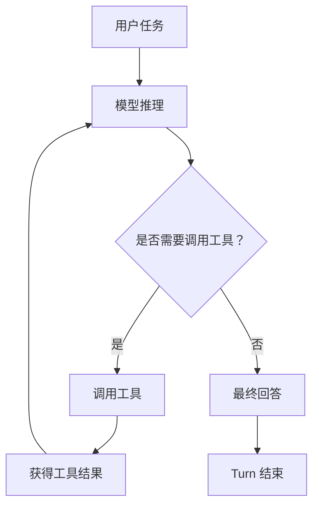
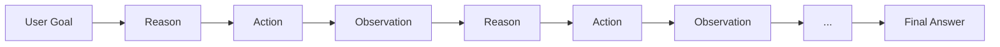
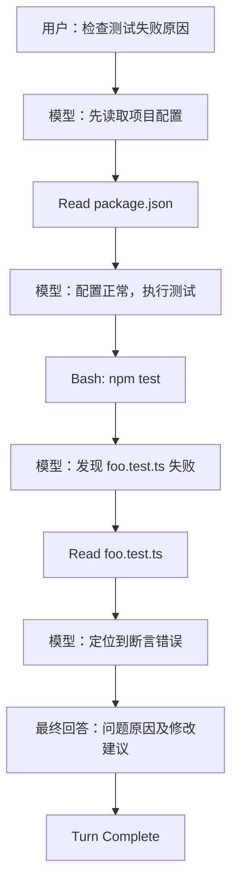
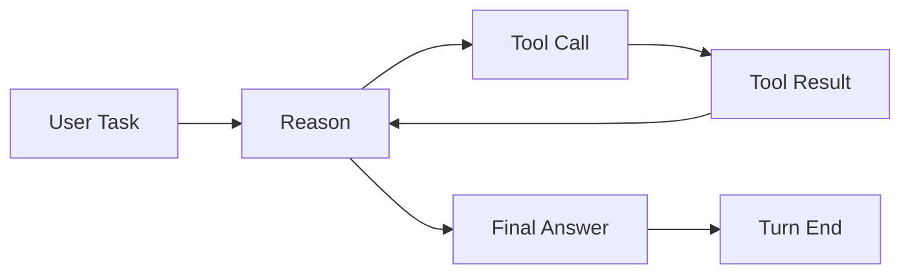

# 一次讲清楚 Agent 中的 Turn

大家在使用Codex或者其他Harness的桌面应用时应该发现了，我们下达一个任务，Agent中间有很多工具调用，并且把中间过程隐藏起来，在最后都会回复一段文本然后结束本次任务。

不知道大家想过这是为什么吗？

Harness框架是怎么知道什么结束任务，中间过程为什么要隐藏起来。

在 Claude Code、Codex 这类 Agent Harness 中，经常会看到一个概念：

**Turn。**

理解 Turn 很重要，因为 Agent 的一次用户请求，往往并不只对应一次模型调用。

---

## 一、什么是 Turn？

可以先记住一个最简单的定义：

> **一个 Turn，是从用户发起一次任务开始，到 Agent 完成这次任务并返回最终结果为止的完整执行过程。**

例如用户输入：

```text
帮我分析这个项目为什么启动失败。
```

Agent 可能需要：

```text
读取配置
→ 查看代码
→ 执行命令
→ 分析结果
→ 再读取文件
→ 再执行测试
→ 最终回答
```

虽然中间调用了很多次模型和工具，但它们都在完成同一个用户任务，所以仍然属于：

```text
一个 Turn
```

---

## 二、一个 Turn 并不等于一次模型调用

普通聊天通常比较简单：

```text
User
 ↓
LLM
 ↓
Answer
```

但 Agent 不一样。

模型可能需要通过工具不断获取新的信息：



因此一次 Turn 内部可能发生：

```text
LLM #1
→ Tool

LLM #2
→ Tool
→ Tool

LLM #3
→ Tool

LLM #4
→ Final Answer
```

虽然模型调用了 4 次，但它们仍然只是一个 Turn。

---

## 三、为什么模型需要反复调用工具？

因为模型无法在第一次推理时就拥有完成任务所需的全部信息。

例如用户要求：

```text
帮我找出项目启动失败的原因。
```

第一次模型可能只知道：

```text
需要先查看 package.json。
```

于是调用：

```text
Read(package.json)
```

拿到结果后，模型发现启动脚本本身没有问题，于是继续：

```text
需要看看报错日志。
```

再调用：

```text
Read(error.log)
```

从日志发现 Node.js 版本异常，于是可能继续执行：

```text
node --version
```

最后信息足够，模型才回答：

```text
项目启动失败是因为当前 Node.js 版本过低。
```

整个过程可以理解成：



这整条行为轨迹，就是一个 Turn。

---

## 四、Turn 本质上是一条 Agent Trajectory

从 Agent 的角度看，一个 Turn 也可以理解成：

> **模型为了完成一个用户目标所经历的一整条行为轨迹。**

也就是：

```text
User Goal
    ↓
Reason
    ↓
Action
    ↓
Observation
    ↓
Reason
    ↓
Action
    ↓
Observation
    ↓
...
    ↓
Final Answer
```

其中：

* **Reason**：模型根据当前信息判断下一步做什么；
* **Action**：调用工具、执行命令、读取文件等；
* **Observation**：工具执行之后返回的新信息；
* **Final Answer**：模型认为信息已经足够，不再需要继续行动。

因此 Turn 并不是单纯的一条回答。

它包含的是：

```text
用户目标
+
模型推理
+
工具调用
+
工具结果
+
继续推理
+
最终回答
```

---

## 五、什么时候一个 Turn 结束？

抛开异常、超时、预算等工程情况，判断规则其实非常简单：

> **只要模型还想继续调用工具，Turn 就还没有结束。**

例如：

```text
模型：
“我先检查一下配置文件。”

+ tool call
```

虽然模型已经输出了文字，但因为还有 Tool Call：

```text
Turn 继续
```

工具执行完成之后，结果重新交给模型。

模型再次判断：

```text
是否还需要更多信息？
```

如果还需要：

```text
继续调用工具
```

如果不需要：

```text
输出最终回答
```

Turn 才真正结束。

因此最简单的 Harness 逻辑甚至可以写成：

```python
while True:
    response = call_model()

    if response.has_tool_calls:
        results = execute_tools(response.tool_calls)
        add_results_to_context(results)
        continue

    return response
```

这里：

```text
有 Tool Call
→ Turn 继续
```

而：

```text
没有新的 Tool Call
→ 模型正常完成回答
→ Turn 结束
```

---

## 六、不要把“出现 Text”理解成 Turn 结束

这是一个很容易误解的地方。

模型可能输出：

```text
我先检查一下相关代码。
```

然后紧接着：

```text
Read(...)
```

所以：

```text
出现 Text
```

并不意味着 Turn 已经结束。

真正重要的是：

```text
后面还有没有 Tool Call
```

例如：

```text
LLM #1
text + tool call
→ Turn 未结束

LLM #2
text + tool call
→ Turn 未结束

LLM #3
tool call
→ Turn 未结束

LLM #4
final text
→ Turn 结束
```

因此更准确的定义是：

> **当模型不再请求新的工具，而是正常给出最终结果时，这个 Turn 才结束。**

---

## 七、用一个完整例子理解

用户：

```text
帮我检查为什么项目测试失败。
```

Agent：



从外部看：

```text
用户问了一次
Agent 回答了一次
```

但内部实际上经历了：

```text
模型调用
→ 工具
→ 模型调用
→ 工具
→ 模型调用
→ 工具
→ 模型调用
→ 最终答案
```

这些全部属于同一个 Turn。

---

## 八、Turn 为什么是 Agent Harness 中的重要概念？

因为它给 Agent 的一次任务执行划定了一个非常清晰的生命周期：

```text
Turn Start
    ↓
理解用户目标
    ↓
不断推理与行动
    ↓
获得环境反馈
    ↓
继续决策
    ↓
任务完成
    ↓
Turn Complete
```

对于 Harness 来说，它真正管理的是：

> **“为了响应这一次用户请求，Agent 还需不需要继续行动？”**

而不是简单地判断：

```text
模型 API 请求结束了吗？
```

一次 API 请求结束之后，模型完全可能因为需要 Tool Result 而继续下一次请求。

所以：

```text
Model Response 结束
≠
Turn 结束
```

只有整个 Agent 行为链结束：

```text
不再需要新的 Tool Call
+
给出最终回答
```

才意味着 Turn 真正完成。

---

## 总结

理解 Turn，只需要记住一句话：

> **一个 Turn，就是用户发起一次任务后，Agent 为完成这个目标经历的完整“推理 → 行动 → 观察 → 再推理”过程，直到模型不再调用工具并给出最终结果。**

可以用最简单的一张图概括：



所以即使后台发生：

```text
10 次模型调用
20 次工具调用
几十次中间状态变化
```

只要它们都在处理用户刚刚下达的同一个任务，在 Agent Harness 看来：

**这仍然只是一个 Turn。**
