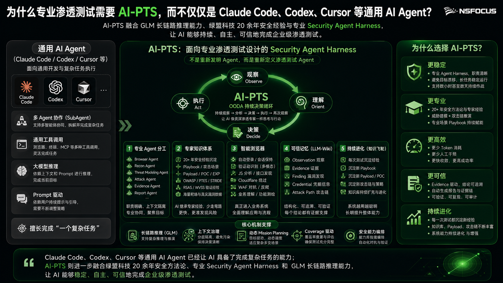

从今年3月加入绿盟科技到现在，已经四个多月了。这段时间里，我经历了从初入团队时的迷茫无措，到逐渐适应团队，再到真正为团队带来价值、慢慢找到自己位置的过程。

入职以来，我写过代码、部署过系统、维护过靶场，也做过PPT、剪过发布会的演示视频。有一段时间，我经常怀疑：我到底是不是一个研发工程师？希望这篇文章能够给想了解研发工程师日常工作的朋友，提供一些来自我个人的工作视角。

## 初入团队：从不懂安全到完成第一个任务

3月刚加入团队时，因为我大学所学的专业是人工智能，对网络安全了解很少，基本不知道具体是做什么的，刚开始难免有些焦虑。我接手的第一个任务，是在IDUN——一个CI/CD管理系统——上部署C2和WebShell相关服务。C2是后渗透阶段使用的控制器，WebShell则可以通过脚本远程控制被入侵的系统。我们正在开发的产品叫AI-PTS，是一套智能化渗透测试系统。

此前我接触过不少Docker，但从来没有真正使用过Kubernetes。对于个人项目和我之前实习过的小团队来说，基本用不上这样复杂的部署和资源调度系统。第一次接触Kubernetes，各种配置看得我头皮发麻。因为不了解相关配置，我问了AI，折腾了半天还是没有解决。最后，我向导师请教，他给我讲解了ConfigMap、Deployment等概念。我根据新的理解，很快顺利完成了任务，整个过程甚至不到一个小时，比自己继续摸索半天高效得多。

这里并不是建议大家遇到问题后什么都不尝试，直接去问别人。在提问之前，我们应该尽可能先自己尝试、主动思考，最好能够明确自己遇到的问题究竟是什么。带着自己的尝试过程和具体问题去请教，也是对别人时间最基本的尊重。《提问的智慧》（How To Ask Questions The Smart Way）就很值得一看。

## 先见森林，再见树木

在此之前，我接触过的项目大多是一个前端、一个后端，分别对应两个代码仓库。而AI-PTS采用的是Golang微服务架构，包含接近十个模块。毫不夸张地说，第一次看到整个项目时，我真的是两眼一黑：不知道应该从哪里看起，也不知道整个系统究竟是怎样运行的。

站在现在的视角回看，我认为面对这类复杂系统，应该先见森林，再见树木。不应该过早进入具体的代码细节，而是应该先从整个系统着手：首先亲自操作一遍，了解系统到底在完成一件什么事情；然后尝试把系统功能和代码模块对应起来，大致理解各个模块之间的协作关系；最后，再进入具体的代码仓库阅读代码。否则，很容易一开始就陷入无穷无尽的细枝末节，被局部信息迅速淹没，看不清系统的整体结构。

这是我后来复盘初期探索过程时，得出的一个重要经验。

## 从三方认证开始理解开发

接下来，我接手了一个相对较大的任务：在网关中开发第三方认证接口。这个需求来自客户。客户希望把AI-PTS接入自己的业务系统，在不登录我们前端页面的情况下，就能够完成渗透任务的下发、查询等操作，实现与自身OA或业务系统的集成。

导师向我介绍了整体思路：使用AK/SK，也就是Access Key和Secret Key进行身份认证。客户持有对应的访问凭证后，就可以调用开放接口。我需要在Gateway模块中完成相关的认证功能开发和接口路由，同时还不能影响系统现有的其他接口。为此，我增加了`third_party`前缀，对第三方接口进行区分。

在这个开发过程中，我也总结出了一个小心得：在开始开发之前，应该先把整体逻辑理解清楚，然后向导师或者负责该模块的同事复述一遍自己的理解，请他们帮忙确认方向是否正确。尽量不要一开始就埋头苦干，因为很可能从最开始就理解错了方向，最后不仅浪费自己的时间，也会拖累项目进度。

我通常会先把自己对需求和实现方式的理解梳理清楚，通过企业微信发送给相关同事。他们只需要快速确认一下；如果没有问题，我就可以直接开始开发。这样做主要有三个好处：

1. 避免从一开始就走错方向。
2. 即使理解有误，也能快速纠正。前辈能够清楚看到你在哪个环节理解错了，并针对问题提供指导。
3. 当你把需求和实现逻辑梳理清楚后，也会对后续使用AI辅助编程有很大帮助。AI能够更快理解需求，也更有可能生成符合预期的代码。

## 那些看似“不像研发”的工作

此后，我开始接触各种各样的任务。作为一个刚加入团队的新人，领导和同事一开始也不清楚你究竟擅长什么，通常是哪里需要人，你就去哪里帮忙。这段时间里，我做过POC缺失信息补充，部署过DVWA、JeecgBoot、Vulfocus等靶场，负责过靶场运维和AI-PTS在各个靶场中的性能表现统计，也参与了子域名扫描模块的开发与适配、WebShell反连、靶场漏洞基准建立，以及AI-PTS在新服务器上的部署和启动。

所谓靶场漏洞基准建立，就是通过白盒代码审计、网络资料检索等方式，尽可能收集靶场中已知的漏洞，并将这些漏洞作为基准，用来评估AI-PTS的漏洞发现准确率和检出率。

对于一个新人来说，心中多少会有一点不甘心，总想着自己应该去做一些“更加有价值”的事情。有时候我甚至会想：我到底是研发，还是运维？哈哈，工作有时候就是这样。并不是因为你的岗位叫研发工程师，你就只需要一直写代码和开发功能。

但是，正是通过这些各种各样的任务，我对整体业务、整个系统，甚至公司的部分流程，都有了更加完整的了解。有时候，我们不能过早把自己限制在所谓的“岗位职责”之内。更重要的是充分发挥自己的主观能动性，从工作中获取更多对个人成长和职业发展有价值的东西，而不是把自己的价值局限在写代码这一件事情上。

## 转折：在PPT中找到新的价值

一个关键转折点，发生在上个月为售前同事制作的一份PPT中。在我的理解中，PPT制作最困难的部分，并不是把页面做得多么精美，而是如何呈现这一页真正想讲的内容。我相信很多人手里都不缺相关材料，真正困难的是：应该选择哪些内容、舍弃哪些内容，又该用什么方式将核心信息呈现出来。否则，最后往往只是在PPT上堆砌大段文字，页面看起来毫无重点，观众看完也不知道这一页的核心观点是什么。当然，我曾经也是其中之一。

因此，我开始尝试使用AI辅助制作PPT。AI生成出来的页面，在我的评价体系中完全可以达到80分，甚至更高。这里主要是指使用Nano Banana或者Image-2等模型，直接生成完整页面图片的制作方式。

AI确实可以帮助我们快速生成逻辑较为清晰、排版美观、重点突出的页面，但真正困难的仍然是：这一页到底要讲什么，应该舍弃什么，观众看完后必须记住什么。

最终，我使用AI制作出来的PPT，让我的上级、产品经理和产品总监都感到很震撼。他们还专门让我分享具体的制作方法。后来，我把自己使用AI制作PPT的流程整理下来，与他们进行了分享。此后，包括部门月报在内的一部分PPT工作，也开始由我负责。

说实话，我自己也感到怀疑和诧异：我不是研发工程师吗？我到底在干什么？在这之前，我确实为此怀疑和焦虑过。我甚至有些反感做这些事情，因为它们占据了很多时间，导致我无法投入更多精力进行系统开发。在当时的认知中，我认为写代码和开发系统才是自己的核心价值，也是未来职业发展中最重要的技能。

直到前段时间，我看了一个自己很喜欢的B站UP主发布的充电视频。视频讨论的是如何发现自己的天赋，以及如何突破职场天花板。里面提到了一个对我影响很大的观点：

> “存在先于本质。”

我不应该因为岗位JD中写着“研发工程师”，就把自己完全限制在研发这个角色里，更不应该片面地认为，自己是研发，就只能做所谓的研发工作。当然，这并不是一种自我PUA，也不是要求自己无条件接受所有额外工作。

在制作PPT的过程中，我能够真实地感受到一种沉浸和享受。我可以把组内其他同事开发出来的优秀产品，用更加直观、更加容易被客户理解的方式呈现出来，让别人明白我们做了什么，能够帮助他们解决什么问题。在这个过程中，我是兴奋的，也是有自己思考的。这种快乐甚至并不完全来自工作为我带来的收入或者社会地位，而是因为我切实感受到了自己在公司和团队中的价值。我感到很开心。

## 从PPT到发布会

因为自己的PPT呈现能力还不错，我也借此机会全程参与了AI-PTS发布会的筹备和正式开展。单纯从美观程度和视觉表现力来看，我制作的PPT肯定无法和专业人士相比。但我认为，一份PPT最重要的部分，仍然是整体大纲的设计，以及建立在对业务、产品、技术和“为什么要这样做”的深刻理解之上，对每一页内容进行提炼。这恰恰是我相对独特的优势。

后期的专业美化工作，可以交给更加专业的人来完成。只有内容理解和视觉表达结合起来，最终做出的PPT才会既有内容、有深度，同时也足够美观。

甚至到了发布会后期，演示视频最终也由我重新剪辑。最初，视频是由公司的专业人员负责剪辑的。并不是说他的剪辑技术不好，而是因为他不了解我们真正想展示的业务逻辑。哪里需要详细展示，哪里可以快速略过，哪里需要进行特写，以及不同内容应该如何配合发布会讲解人的节奏，这些都建立在对产品和演示逻辑的理解之上。

因此，在发布会前一天晚上，我重新剪辑了四条演示视频，一直忙到半夜。我的剪辑技术其实非常初级，无非是加速、减速、增加特写。但我能够保证整个视频详略得当，并且符合发布会讲解人的节奏。当时，我的上级负责现场讲解，我们住在同一家酒店，可以随时沟通和配合。他希望某一个部分如何展示，我能够迅速理解，并尽快剪出符合他预期的效果。

## 不再急着定义自己

现在回过头看，我不由得会想：我到底是一个什么角色？哈哈。写代码、系统部署、环境运维、PPT制作、视频剪辑，这些技能看起来似乎毫不相关，但它们又彼此纠缠。它们都建立在同一个基础之上：对业务逻辑、产品能力以及团队正在做的事情有足够深入的理解。

没有这个根基，即使单独掌握了其中某一种技能，也很难真正做好发布会最终的呈现效果。正是因为写过代码，我对系统底层的运行逻辑有一定了解；因为参与过部署，我知道系统由哪些组件构成，也理解各个组件之间的关系；因为做过靶场运维和效果评估，我知道产品实际解决了哪些问题；也正因为具备这些从底层到上层的理解，我才能相对准确地把产品价值呈现出来。

我不是因为会做PPT才产生了价值，而是因为理解技术、系统和业务，才能通过PPT和视频，把团队的价值表达出来。

所谓“存在先于本质”，在我的理解中，就是我们本身如同一张白纸。这张白纸最终会出现怎样的内容，取决于我们如何绘制，而不是在出厂时就按照某种模板固定生产出来。对于工作也是如此，我们不应该完全被工作岗位所定义，而应该尝试用自己的行动，重新定义自己能够在工作中创造什么价值。

所谓实现年薪百万的目标，也许并不是把“年薪百万”作为一个形而上的目标不断追逐，而是找到自己愿意投入、能够沉浸、相对擅长，并且能够持续创造价值的事情。当一个人在某个领域真正做到前列时，收入或许只是自然产生的结果。

直到现在，我依然不知道应该如何准确地定义自己。研发工程师、产品表达者、技术内容策划，这些称呼似乎都不完全准确。

我也不知道自己在PPT呈现和产品表达方面的能力，是否能够被称为所谓的“天赋”。但至少，它是一件我愿意投入、能够沉浸，并且确实能够为团队带来价值的事情。

最后，我也希望大家不要过早被自己的工作岗位限制，更不要因为一份岗位职责，就提前划定自己能力和价值的边界。可以试着寻找一下，在工作中是否存在某件事情，能够给你带来一种超越收入、社会地位和职位本身的快乐与享受。

也许，那里就藏着突破自己职业天花板的可能性。
