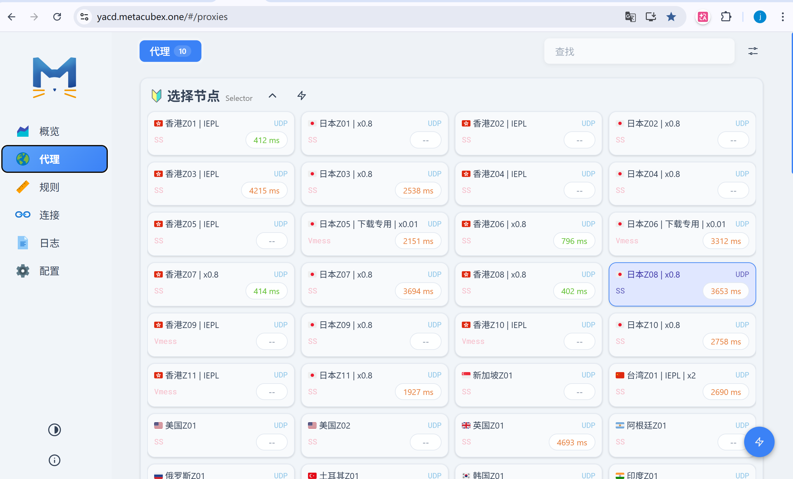

### 背景

小区内使用代理特别卡，几乎所有节点都是 TimeOut，出了小区就很正常，不知道是不是社区的网络设置了什么拦截措施，然后就想到了使用服务器作为中转代理，在服务器上面部署代理，然后让本机的流量走中转服务器，完成对外网的访问

### 具体操作

将远端中转服务器（宽带环境好、已部署 Clash）的网络能力，完美进行中转代理。实现：
1. **科学加速**：本地浏览器丝滑访问 GPT/Google 等外网，摆脱小区宽带卡顿，且能在本地可视化切换节点。
2. **无感分流**：国内网站直连，互不干扰。

### **核心操作与排坑全梳理**

**安装 clash**

参考[之前的安装博客](https://www.davidxiong.site/blog/clash_for_linux/)，在服务器安装完成后，修改 `/etc/clash/config.yaml`，将 `external-controller` 从 `9090` 改为了 `9091`，避开系统的端口冲突，在我操作过程中遇到了这个问题，大家提前避免一下。这个 external-controller 是便于我们在图形化界面控制 clash，比如说选择不同节点。

**第一阶段：打通物理隧道 (SSH 端口转发)**

这是整个方案的基石。我们需要建立两条本地到远端的映射通道：

- **数据通道**：将本地的 `7891` 端口映射到远端 Clash 的 HTTP 代理端口 `7890`。
- **控制通道**：将本地的 `9090` 端口映射到远端 Clash 的 API 端口 `9091`。

此处提供两种常见的实现方式，可根据所用的终端工具自行选择。

**方式一：通过 Xshell 配置**

利用 Xshell 的图形化界面配置，优势在于规则持久化，每次连接该服务器会话时隧道自动生效。

1. 打开目标服务器的会话属性，导航至 **SSH -> 隧道 (Tunneling)**。
2. 点击添加，配置第一条数据转发规则：
   - **源端口 (Source Port)**: `7891`
   - **目标主机 (Destination Host)**: `127.0.0.1`（注意：务必填写本地环回地址，切勿填服务器公网或局域网 IP）
   - **目标端口 (Destination Port)**: `7890`
3. 再次点击添加，配置第二条控制转发规则：
   - **源端口 (Source Port)**: `9090`
   - **目标主机 (Destination Host)**: `127.0.0.1`
   - **目标端口 (Destination Port)**: `9091`
4. 保存配置。断开当前连接并重新连接，使隧道规则生效。

**方式二：通过原生 SSH 命令实现**

一条命令即可在后台建立上述双通道转发。

```bash
# 替换 user 和 server_ip 为实际的远端服务器用户名和地址
ssh -N -f -L 7891:127.0.0.1:7890 -L 9090:127.0.0.1:9091 user@server_ip
```

参数说明：
- `-L`：指定本地端口到远端主机及端口的映射。
- `-N`：仅建立端口转发，不执行远程 Shell 命令。
- `-f`：认证完成后使 SSH 进程在后台运行。

若希望免去每次输入长命令的繁琐，可将规则写入本地 `~/.ssh/config` 文件：

```ssh-config
Host clash-proxy
    HostName server_ip
    User user
    LocalForward 7891 127.0.0.1:7890
    LocalForward 9090 127.0.0.1:9091
```

后续只需执行 `ssh -N -f clash-proxy` 即可打通隧道。

#### **第二阶段：服务端环境 Clash 端口冲突**

在连接可视化面板时，如果遇到了本地 `9090` 端口"毫无反应"甚至弹出系统登录框的诡异现象。
• **排查手段**：通过 `netstat -tulnp | grep 9090` 和查看 Clash 启动日志。
• **发现真相**：服务器的系统级服务 `systemd`（通常是 Cockpit 管理面板）死死霸占了 `9090` 端口。Clash 启动时发现端口被占，直接放弃了开启控制台 API。 如果遇到类似的问题，修改 `/etc/clash/config.yaml`，将 `external-controller` 从 `9090` 改为了 `9091`，或者其他空闲的端口，并执行 `systemctl restart clash`。避开端口冲突！

#### **第三阶段：本地可视化接管 (yacd 面板)**

服务端就绪后，我们在本地打开了网页版的控制中心。
• 打开 `http://yacd.metacubex.one`。
• 填入本地映射好的 API 地址：`http://127.0.0.1:9090`（如果没有密码，Secret 留空，查看密码的方式：cat  /etc/clash/config.yaml | grep secret ，看看有没有返回密码）。
• **成果**：成功看到了服务器的 Clash 面板，并手动将策略组切换到了延迟更低**节点**。



#### **第四阶段：浏览器应用层路由 (Zero Omega 配置)**

隧道建好了，最后一步是让浏览器的流量走隧道代理，安装 Proxy SwitchyOmega3 这个浏览器插件。
• **新建代理情景模式 (`clash-server`)**：指向本地的 `127.0.0.1:7891`。
• **配置自动切换 (`auto switch`)**：将外网流量交给 `clash-server`，内网 IP 走内网代理，实现智能分流。

**排坑（协议与分流策略的博弈）：**
1. **协议不匹配（ERR_EMPTY_RESPONSE）**：起初把插件协议写成了 `SOCKS5`，但对端服务器的 `7890` 是 `HTTP` 代理。SOCKS5 听不懂 HTTP，导致连接掐断。**修正为 HTTP 后秒通。**
2. **分流太死板（网页一直转圈）**：最初只加了 `*.google.com` 等规则，导致网页依赖的静态资源（如 `gstatic.com`）被直连卡死。**终极解法：** 清空手动域名规则，把默认流量全抛给 `clash-server`，让服务端 Clash 内置的强大规则库（国内直连/国外代理）来做智能裁决。
****

#### **现在的全景流量路线图**

你现在的每次点击，流量都在进行一次优雅的旅行：
1. **访问国内网站 (如 百度)**：
浏览器 $\rightarrow$ `Zero Omega` $\rightarrow$ `clash-server (7891)` $\rightarrow$ `Xshell 隧道` $\rightarrow$ `服务器 Clash` $\rightarrow$ 判定为国内 $\rightarrow$ **直连返回**。
2. **访问国外网站 (如 ChatGPT)**：
浏览器 $\rightarrow$ `Zero Omega` $\rightarrow$ `clash-server (7891)` $\rightarrow$ `Xshell 隧道` $\rightarrow$ `服务器 Clash` $\rightarrow$ 命中代理规则 $\rightarrow$ 走**代理节点** $\rightarrow$ **极速响应**。
