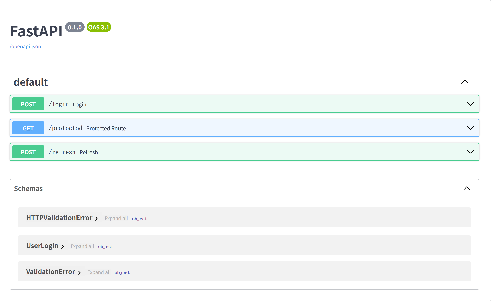
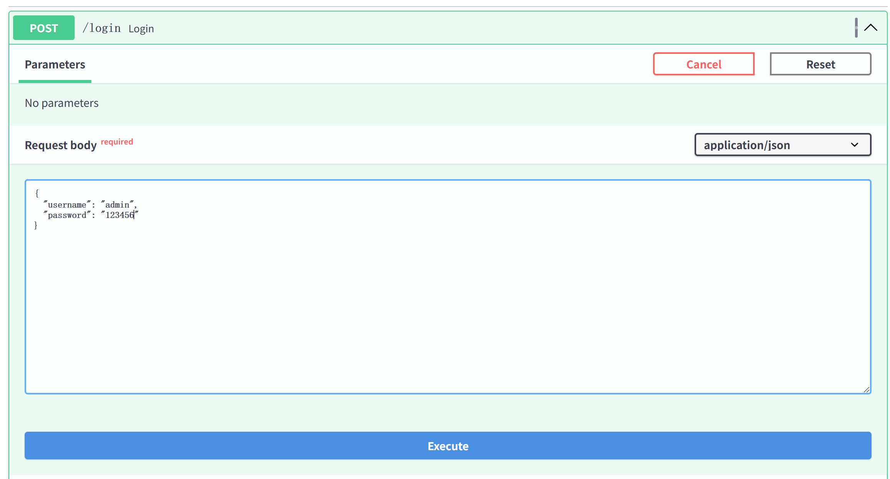
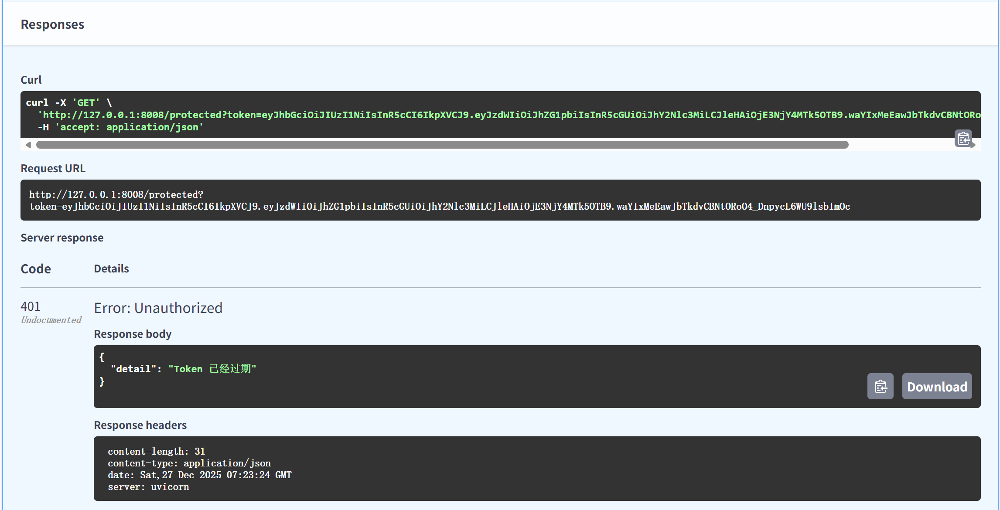

这篇博客旨在通过最直观的逻辑和最精简的代码，带你彻底看穿 JWT 鉴权的底层真相。我们将不只是学习如何调用库，而是探究**为什么要这么设计**。


# 深度拆解：从原理到实战的 JWT 鉴权指南

在现代 Web 架构中，鉴权（Authentication）是绕不开的话题。你可能听说过 Session，但为什么现在的分布式系统、微服务等都在用 **JWT**？

### 1. 为什么要用 JWT？（抛弃“中心化”的账本）

传统的 **Session** 模式像酒店前台：你领到房卡（SessionID），前台必须在账本（数据库/Redis）里记下你的信息。每次你开门，前台都要翻账本确认。如果酒店（服务器）变大了，有 10 栋楼，账本同步就成了噩梦。

**JWT (JSON Web Token)** 像电子护照：护照里直接写着你的名字和有效期，最重要的是上面有**防伪印章**。安检员（服务器）不需要查任何数据库，只要肉眼验准了印章是真的，就放你通行。把Token的保存和管理放在客户端，也就是浏览器中存储，服务器只负责对Token进行校验

**核心优势：**

* **无状态**：服务器不存任何数据，横向扩展极其容易。
* **解耦**：认证服务器和业务服务器可以完全分离。


### 2. JWT 的构造：三段式的数学美学

一个 JWT 字符串由三个部分组成：`Header.Payload.Signature`。

* **Header (头部)**：声明类型（JWT）和哈希算法（HS256）。
例如：
```c
{
    "alg": "HS256",
    "typ": "JWT"
}
```
* **Payload (负载)**：存放真正的数据，比如 `user_id`。**注意：它是 Base64 编码的，任何人都能解开查看里面的数据，绝对不能放密码！**

* **Signature (签名)**：核心防伪标志。


**防篡改逻辑：** 黑客虽然可以改 Payload 里的用户 ID，但他没有 `SECRET_KEY`，无法生成与之匹配的签名。服务端校验时发现签名对不上，立刻就会拒绝访问。但是黑客可以伪造一个签名，所以需要一个防篡改的机制，这个机制就是上面的Signature。


### 3. 双令牌机制：安全与体验的博弈

为什么代码里要搞 `access_token` 和 `refresh_token` 两个令牌？

1. **Access Token (短期)**：权限的载体。为了安全，它的有效期通常很短（如 15 分钟）。如果被黑客截获，损失也有限。
2. **Refresh Token (长期)**：身份的延续。它不参与业务访问，专门用来换取新的 Access Token。

**为什么要这么折腾？** 如果只用一个长效 Token，一旦泄露，黑客将长期控制你的账号；如果只用一个短效 Token，用户每隔一分钟就要重新登录一次，体验极差。双令牌完美平衡了这两点。上面的方式，大家可能会发现一个bug，也就是用户频繁使用应用，令牌会不断刷新，用户一直处于登录状态，如果你不希望用户长期登录，可以设置一个会话过期时间（比如15天），在用户首次登录的时候，在数据库记录该用户的会话过期时间，当会话过期时间到了，强制用户重新登录。


### 4. 实战代码演示：FastAPI 沙盒环境

这段代码实现了一个纯净的 JWT 鉴权闭环。请注意其中的 `type` 字段，这是区分不同类型Token（access_token和refresh_token）的关键：
为了防止用于加密的秘钥的安全性，建议至少使用32字节（256位）的JWT秘钥，下面是生成base64编码的32字节秘钥的powershell命令和bash命令，根据自己的系统自行选择
```powershell
# powershell
$bytes = New-Object Byte[] 32
$rng = New-Object System.Security.Cryptography.RNGCryptoServiceProvider
$rng.GetBytes($bytes)
$base64Key = [System.Convert]::ToBase64String($bytes)
Write-Output $base64Key
```

```sh
# bash
openssl rand -base64 32
```

安装依赖：
```sh
pip install pyjwt fastapi pydantic uvicorn
```

创建一个main.py文件，内容如下：

为了更好的演示，这里设置access_token的有效期为1分钟，refresh_token的有效期为7天。生产环境可以根据业务需求进行调整。

```python
import jwt
import datetime
from fastapi import FastAPI, HTTPException, Depends, status
from pydantic import BaseModel

# 1. 配置（核心密钥）
SECRET_KEY = "pHOvQSeEtBSg+lZu0wObdlUDjFwBajfKAsRnRtYbPE8=" # 32字节（256位）的JWT秘钥
ALGORITHM = "HS256" # 使用HS256算法进行加密

app = FastAPI()

# 模拟数据库
fake_user_db = {"username": "admin", "password": "123456"}

# --- 数据模型 ---
class UserLogin(BaseModel):
    username: str
    password: str

# --- 核心逻辑函数 ---

def create_token(data: dict, expires_delta: datetime.timedelta):
    """生成 JWT 的核心逻辑"""
    to_encode = data.copy()
    expire = datetime.now(timezone.utc) + expires_delta
    to_encode.update({"exp": expire})
    return jwt.encode(to_encode, SECRET_KEY, algorithm=ALGORITHM)

def verify_access_token(token: str):
    """校验 JWT 的核心逻辑"""
    try:
        payload = jwt.decode(token, SECRET_KEY, algorithms=[ALGORITHM])
        if payload.get("type") != "access":
            raise HTTPException(status_code=401, detail="无效的访问令牌类型")
        return payload
    except jwt.ExpiredSignatureError:
        raise HTTPException(status_code=401, detail="Token 已经过期")
    except jwt.InvalidTokenError:
        raise HTTPException(status_code=401, detail="无效的 Token")

def verify_refresh_token(token: str):
    """校验 Refresh Token 的核心逻辑"""
    try:
        payload = jwt.decode(token, SECRET_KEY, algorithms=[ALGORITHM])
        if payload.get("type") != "refresh":
            raise HTTPException(status_code=401, detail="无效的刷新令牌类型")
        return payload
    except jwt.ExpiredSignatureError:
        raise HTTPException(status_code=401, detail="Refresh Token 已经过期")
    except jwt.InvalidTokenError:
        raise HTTPException(status_code=401, detail="无效的 Refresh Token")
# --- 路由接口 ---

@app.post("/login")
async def login(user: UserLogin):
    # 验证逻辑简化
    if user.username == fake_user_db["username"]:
        # 签发双令牌
        access_token = create_token({"sub": user.username,"type":"access"}, datetime.timedelta(minutes=1))
        refresh_token = create_token({"sub": user.username,"type":"refresh"}, datetime.timedelta(days=7))
        return {"access_token": access_token, "refresh_token": refresh_token}
    raise HTTPException(status_code=400, detail="用户名错误")

@app.get("/protected")
async def protected_route(payload: dict = Depends(verify_access_token)):
    """受保护的接口，演示如何提取用户信息"""
    return {"message": f"欢迎回来, {payload['sub']}", "data": "这是敏感数据"}

@app.post("/refresh")
async def refresh(refresh_token: str):
    """使用 Refresh Token 换取新的 Access Token"""
    payload = verify_refresh_token(refresh_token)
    new_access_token = create_token({"sub": payload["sub"],"type":"access"}, datetime.timedelta(minutes=1))
    return {"access_token": new_access_token}

if __name__ == "__main__":
    import uvicorn
    uvicorn.run(app, host="127.0.0.1", port=8008)

```


### 5. 动手实验：在 Swagger UI 中直观感受

运行上述代码后，访问 `http://127.0.0.1:8008/docs`，这是 FastAPI 自带的 Swagger 交互文档。
如下是swagger的界面：


1. **登录**：点击 `/login`，然后点击Try it out，编辑用户名和密码，输入账号 `admin` 和密码 `123456`，点击Execute。你会得到两个长长的字符串。
执行：

你会得到两个长长的字符串，一个是access_token，一个是refresh_token。


2. **正常访问**：复制 `access_token`访问`/protected`接口，点击Try it out，输入access token。
你会得到：

成功访问了/protected接口，可以看到，我们不在需要输入身份信息，而是使用了access_token来访问接口，这就是JWT的妙用。

3. **等待 1 分钟**：一分钟后再次访问 `/protected`，你会收到 `401 Token 已经过期`，无法访问接口。这就是**时效性校验**。

4. **刷新续命**：这时候我们将刚才拿到的 `refresh_token` 填入 `/refresh` 接口。调用刷新接口进行刷新，你会获得一个新的 `access_token`。拿着新 Token，你又可以继续访问受保护接口了。

5. 通过上面的操作不难理解JWT鉴权的基本流程，就是用户登录后，发放两个Token，一个access_token，一个refresh_token，access_token用于访问接口，refresh_token用于刷新access_token，当access_token过期后，调用刷新接口，使用refresh_token进行刷新，刷新后获得新的access_token，继续访问接口。


## 6. 进阶：结合数据库实现用户强制登出和刷新token轮转

上面的例子中，访问token和刷新token都是程序生成的，这就存在一个问题，如果黑客拿到了 `refresh_token`，他就可以无限次刷新 `access_token`，从而一直获得 `access_token`，一直到 `refresh_token` 过期，而且面对这个问题，我们是束手无策的，我们无法主动让 `refresh_token` 无效，我们可以结合数据库来进行控制。

接下来要讲的就是 **refresh token轮转**，我们需要在 `refresh_token` 的 payload 中新增 `jti` 字段（唯一标识符）和 `user_id` 字段（用户ID），当 `access_token` 过期后，调用刷新接口刷新 `access_token` 的时候，我们先对传入的 `refresh token` 进行校验（字段是否正确，有没有被篡改，是否过期等），如果校验通过，再检查数据库中该 `refresh token` 是否失效。

* **如果失效**：无法进行刷新，用户强制下线重新登录，并且将该用户下所有的 `refresh token` 标记为已失效。
* **如果未失效**：则将传入的 `refresh token` 标记为已失效，同时创建新的 `refresh token`，我们将新的 `refresh token` 存入数据库，并且将新的 `refresh token` 返回给用户。

### 场景模拟

* **场景 A：黑客先于用户使用 refresh_token**
1. 黑客偷走了 `refresh_token1`，并立即调用刷新接口。
2. 服务端把 `refresh_token1` 作废，给黑客发了 `access_token2` 和 `refresh_token2`。
3. **检测点**：当真正的用户尝试用 `refresh_token1` 刷新时，服务端发现 `refresh_token1` 已经是“已失效”状态。
4. **安全响应**：服务端意识到 `refresh_token1` 被重复使用了。这意味着 `refresh_token1` 极大概率已经泄露。此时，服务端不仅拒绝请求，还应该立即撤销该用户下所有的 `refresh_token`，强制所有端下线。


* **场景 B：用户先于黑客使用 refresh token**
1. 用户正常使用 `refresh_token1` 换到了 `refresh_token2`。此时 `refresh_token1` 在数据库中已失效。
2. 黑客尝试用偷来的 `refresh_token1` 去刷新。
3. **检测点**：服务端发现 `refresh_token1` 已失效。
4. **安全响应**：同样，服务端触发警报，作废该用户当前正在使用的 `refresh_token2`。黑客手里过期的 `refresh_token1` 没用，用户手里原本有效的 `refresh_token2` 也会失效，虽然用户需要重新登录，但黑客的攻击被成功阻断。


---

### JWT 虽好，但要注意：

* **密钥管理**：`SECRET_KEY` 一旦泄露，整个鉴权系统就形同虚设，因为黑客可以使用秘钥伪造签名，从而绕过鉴权系统。
* **Payload 脱敏**：永远不要在 Payload 里放用户的手机号、敏感 ID 等。因为它是Base64编码的，任何人都能解开查看里面的数据，**绝对不能放密码！**
* **单点登出难**：JWT 一旦发出，服务端很难主动让其失效。如果需要即时冻结用户，还是需要配合 Redis 的黑名单机制，将签发的 `refresh token` 标记为失效，这样用户就无法再使用该 `refresh token` 来刷新 `access_token`。
