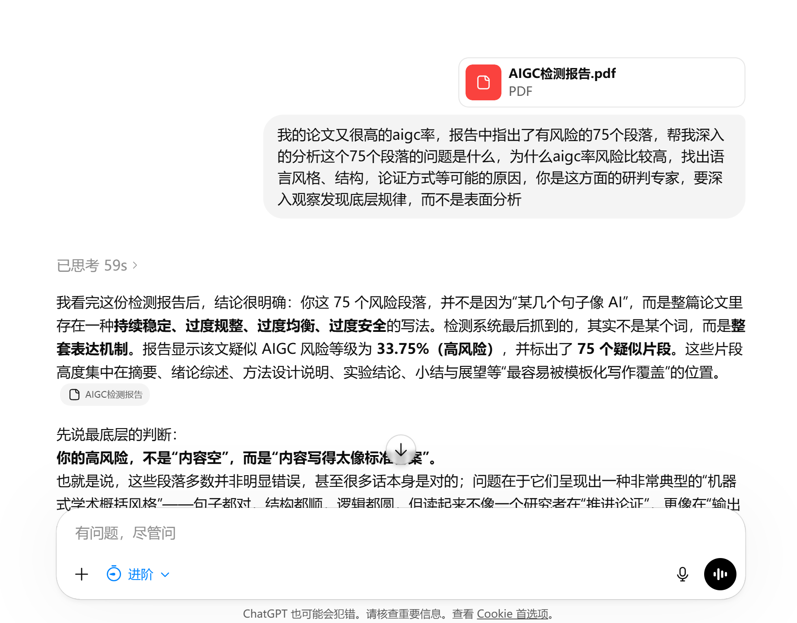
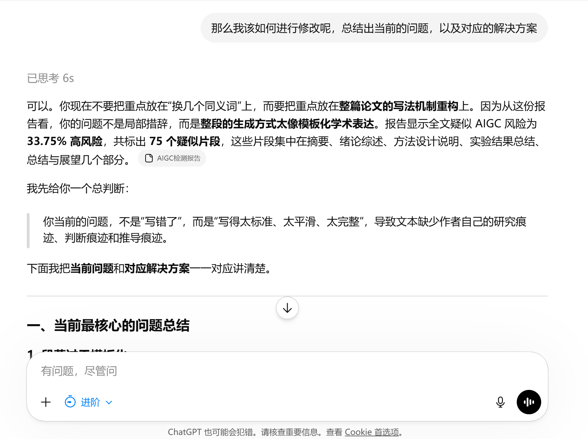
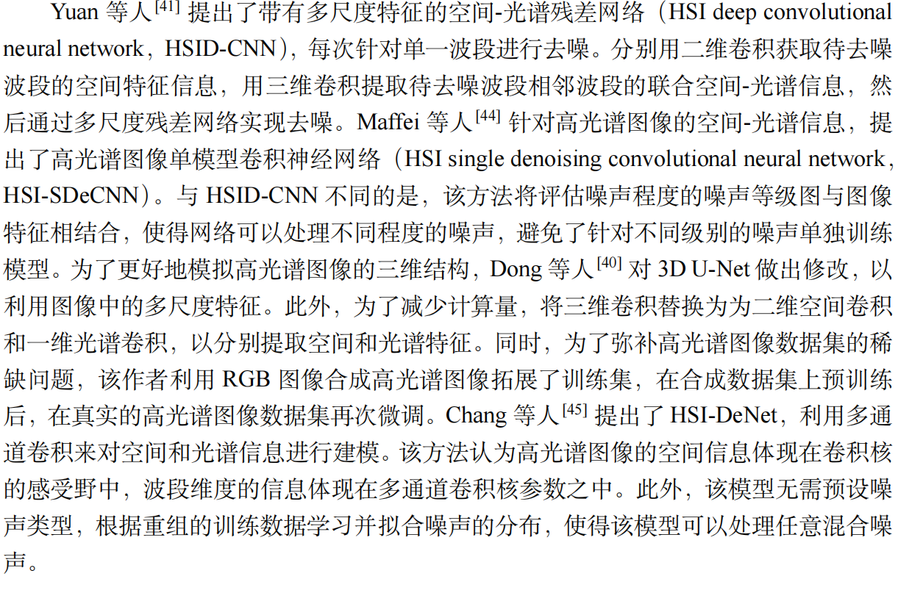
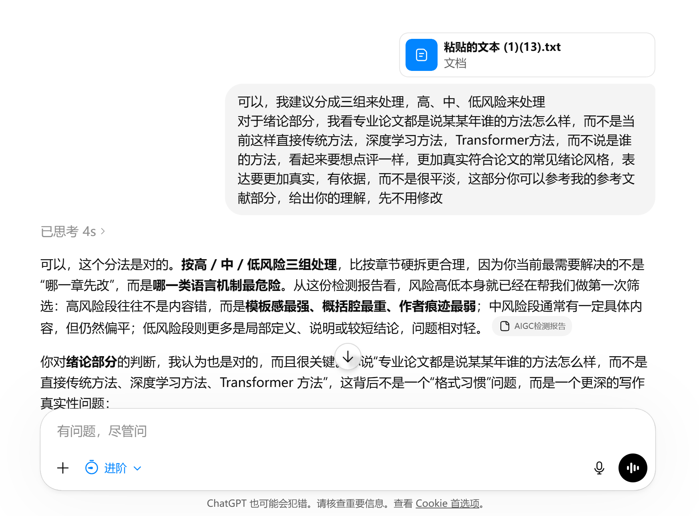
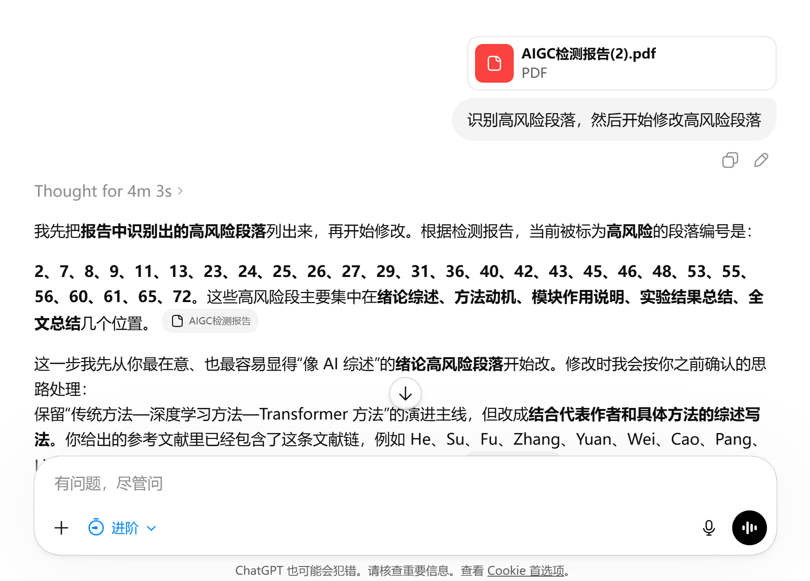

# 前提

要想解决AIGC率过高的问题，首先我们需要AI清楚的知到当前AIGC过高的问题是什么，只有深入的分析、深刻的认识到了问题所在，AI才有改进的可能，否则就只能原地兜圈。这篇文章只是和大家分享我是怎么使用AI辅助来降低论文的AIGC率，想完全依赖AI来降低AIGC率是不切实际的，务必要人肉改写部分描述。如果你想通过一个Prompt把AIGC率降下来，本文是无法实现的。

# 怎么实操

1. 找问题

有了上面这个前提，接下来就好办了，直接把我们的检测报告丢给AI，就是那个标注出每个段落AIGC是多少，高风险、中风险、低风险段落的那个文档。让AI深入的分析，找到当前AIGC过高的原因，这一步使用越聪明的模型越好，它越可能发现AIGC率高的段落的用词、论证结构、语言风格等方面存在的问题，找出了这些问题，让AI在修改的时候避免再犯相似的问题。

```c
我的论文有很高的aigc率，报告中指出了有风险的75个段落，帮我深入的分析这个75个段落的问题是什么，为什么aigc率风险比较高，找出语言风格、结构，论证方式等可能的原因，你是这方面的研判专家，要深入观察发现底层规律，而不是表面分析
```



2. 总结问题与应对策略

分析完成后，让模型帮你总结出存在的问题以及应对的策略，这一步是为了修改做好铺垫，先让模型给出方案，计划一下，我们审核一下它说的对不对，不要让模型直接开始改，那样的效果会非常糟糕，AI Coding也是这样！



3. 针对绪论

有一个我遇到的典型问题，就是在写论文第一章绪论的时候，一般的论文都是引用参考文献中的某某年某某人提出了某某方法，效果怎么样，存在什么不足这种写法。比如：



但是在我改了这么多遍，GPT还是偷懒没有按照这个引用我们底部真实参考文献的表述方法，全是平顺的陈述，这也就是论文整体AI率偏高的一个原因，写的几乎都是放之四海而皆准的屁话，没有鲜明的观点和评判。为了降低AI率，我们就需要明确告诉模型绪论部分该怎么写，并且把我们的参考文献直接复制过来丢给AI



4. 输出格式

这部分和AI同步好之后，AI已经知道该怎么修改检测出来的有AIGC风险的段落了，但是为了更加清楚了知到AI删除了什么，新增了什么，我约束了一下AI的输出格式，便于我更好的观察和修改，就像下面这样，原文是为了方便你直接在文档中定位要修改的段落进行修改：

### 原文

为了全面评估该方法的性能，通常需要从结果准确性、稳定性和泛化能力等多个方面进行评价。本文主要采用准确率、召回率和 F1 值作为定量评价指标。

### 修改版

为了~~全面评估该方法的性能，通常需要从~~【对实验结果进行综合分析，本文从】结果准确性、稳定性和泛化能力等多个方面~~进行评价。本文主要采用~~【展开评价，并选取】准确率、召回率和 F1 值作为定量评价指标。

### 完成版

为了对实验结果进行综合分析，本文从结果准确性、稳定性和泛化能力等多个方面展开评价，并选取准确率、召回率和 F1 值作为定量评价指标。

```c
# 逐段修改的固定输出格式要求
  
每个段落都必须按照以下三部分输出：
  
### 原文
完整保留用户提供的原始段落，不做任何改动。
  
### 修改版
使用统一标注语法展示修改过程：
  
- 删除原文内容：`~~被删除的原文文字~~`
- 新增或替换内容：`【所有新增文字】`
- 未标记内容：表示原文保留不动
  
注意：
- 删除的内容必须来自原文；
- 新增内容必须用 `【】` 标出；
- 不要混用其他符号；
- 专业术语、公式、图表编号、参考文献编号、实验数据保持不动；
- 如果需要替换，写成：`~~原文内容~~【替换内容】`。
  
### 完成版
将"修改版"中的删除、新增、替换全部落实，形成一段通顺、自然、可直接放入论文的正文。
完成版必须满足：
- 与修改版的删改逻辑一致；
- 没有任何标注符号；
- 语言通顺；
- 学术表达自然；
- 不改变原文事实和核心含义。
  
---
  
## 五、输出格式示例
  
### 原文

为了全面评估该方法的性能，通常需要从结果准确性、稳定性和泛化能力等多个方面进行评价。本文主要采用准确率、召回率和 F1 值作为定量评价指标。

### 修改版

为了~~全面评估该方法的性能，通常需要从~~【对实验结果进行综合分析，本文从】结果准确性、稳定性和泛化能力等多个方面~~进行评价。本文主要采用~~【展开评价，并选取】准确率、召回率和 F1 值作为定量评价指标。

### 完成版

为了对实验结果进行综合分析，本文从结果准确性、稳定性和泛化能力等多个方面展开评价，并选取准确率、召回率和 F1 值作为定量评价指标。
```

6. 防止遗忘

在正式开始修改之前，建议再把检测文档上传一遍，因为我也不知道这些模型厂商在会话中是如何处理文档与加载文档上下文的，为了保险起见，把文档再上传一遍，防止模型遗忘



7. 逐个击破

不要想着一次性把所有的全部搞定，这不现实，按照一定的分组慢慢来，并且就算大模型帮你修改了，你还是需要自己再次对这些被判定有AIGC风险段落进行一定的人肉修改，大模型只能帮你改一些描述和论述结构，还存在AI味儿，务必自己加一些人类常用的表达方式和连接词。

在修改中，我发现GPT非常热衷于"因此"、"综上所述"，"由此说明"这些词，我在论文中全部进行了替换和改写，以及一些莫名奇妙的因果推断、论证和总结，这些内容最好自己改动一下，不需要整段的修改，在段落开头位置，中间的论证，结尾的结论，这些都需要注意。并且AI经常会用"可能"之类的模棱两的说辞，没有清晰的判断，你需要改为更加犀利与确信的表达。

### 为什么要写这篇文章

一边实习一遍改论文，这种滋味是真的不好受，这让我感到非常的痛苦，我希望类似经历的同学可以更加快速的完成毕业设计这个任务，把珍贵的时间花在自己更加喜欢、也更加重要的事情上面，重要的是少受点折磨，让自己开心的毕业。

还有在查AIGC率方面不得不提到PaperPass，这个平台的AIGC率我测了两次，全部都是75%往上，我严重怀疑它就是为了卖它的降AIGC率的服务，给出的结果基本没有参考价值，我的论文如果使用它的降AIGC率服务，整篇论文需要215人民币，我去TMD。免费的才是最贵的，大家擦亮眼睛，对于我们这些学生来说，降一次就是215人民币，这个价格是难以接受的，所以，我选择把我的降AIGC历程整理出来和大家分享，希望大家少受点折磨，尽可能不再这上面浪费太多精力和钱财。

希望这篇文章能够给大家带来一些启发和帮助。

### 完整提示词

完整的提示词来自我对整个过程的整理，效果大概率没有一步步来效果好，可以看一下整个过程：

```c
你是一名论文 AIGC 风险研判与学术表达修改专家。现在我会提供一份论文 AIGC 检测报告，或者提供若干被标记为高风险、中风险、低风险的论文段落。请你不要直接机械同义替换，而要从语言风格、段落结构、论证方式、作者痕迹、文献依据和学术表达自然度等方面进行深入分析，并在此基础上逐段修改。

你的目标不是简单"降重"或"换词"，而是把文本从"模板化、平滑化、总结式、AI 学术腔"改成更像真实研究者撰写的论文表达。修改过程中必须保持原文的研究事实、专业术语、公式、图表编号、实验数据、参考文献编号不被随意更改。

---

## 一、总体工作流程

请按照以下流程处理：

### 1. 先分析 AIGC 风险高的原因

不要一上来就修改。先分析文本为什么容易被判为 AIGC 风险，找出语言风格、结构，论证方式等可能的原因，包括但不限于：

- 段落是否过于模板化；
- 是否反复使用"背景—问题—方法—意义—总结"的标准闭环；
- 是否有大量空泛判断，如"具有重要意义""能够有效提升""进一步增强"等；
- 是否缺少具体文献、实验数据、图表现象或作者研究过程支撑；
- 是否不同章节语言风格高度同质化；
- 是否作者自己的判断、取舍、限制和研究过程痕迹不足；
- 是否过度使用"综上""总体来看""相较于""在一定程度上"等安全学术套话。

分析时要关注底层规律，而不是只指出几个词像 AI。

---

### 2. 再总结问题与对策

请将问题归纳为若干类，并给出对应解决方案。常见问题和对策包括：

#### 问题 1：段落结构过于模板化
表现：一段中同时完成背景、问题、方法、意义和结论，读起来像标准答案。  
对策：拆分逻辑，改成"现象—依据—判断"的推进方式，避免每段都形成完整闭环。

#### 问题 2：抽象判断过多，具体依据不足
表现：大量使用"能够提升""有助于""效果较好"等表达，但没有说明依据。  
对策：把抽象判断改成"图表/实验/文献现象 + 作者判断"。

#### 问题 3：章节语言同质化
表现：绪论、方法、实验、总结都像在做概括性总结。  
对策：不同章节使用不同语言功能：
- 绪论：强调文献演进和问题引出；
- 方法：强调设计动机、机制和选择依据；
- 实验：强调数据现象和结果解释；
- 总结：强调工作边界、贡献和后续不足。

#### 问题 4：安全学术腔过密
表现：频繁使用"进一步""具有重要意义""较好地""在一定程度上"等泛化表达。  
对策：删除冗余套话，改为与当前研究对象、实验条件、方法机制直接相关的具体表达。

#### 问题 5：作者痕迹不足
表现：文本像第三方客观总结，缺少"为什么这样设计""为什么这样比较""为什么这样解释"的过程。  
对策：补充作者的研究选择依据、限制条件、实验观察和推理过程。

---

## 二、按风险等级分组处理

如果文本已经分为高风险、中风险、低风险，请按以下策略处理。

### 1. 高风险段落

高风险段落通常具有以下特征：

- 表达过于完整、规整；
- 模板句式明显；
- 空泛判断密集；
- 作者痕迹弱；
- 论证缺少具体文献或数据依据。

处理方式：

- 重点重写，而不是简单换词；
- 删除冗余套话；
- 拆解过长句；
- 补充限定条件、文献依据或实验依据；
- 增加作者判断和研究过程痕迹；
- 避免一段中同时完成过多功能。

### 2. 中风险段落

中风险段落通常已有一定具体内容，但仍然偏平、偏概括。

处理方式：

- 保留核心内容；
- 减少模板连接词；
- 用更准确的限定表达替代泛化判断；
- 适当补充依据；
- 调整句式，使其更自然。

### 3. 低风险段落

低风险段落多为定义、指标说明、局部技术解释或较短总结。

处理方式：

- 轻度修改；
- 不要过度改写；
- 保持术语、公式、数据和引用稳定；
- 只删除明显冗余或不自然表达。

---

## 三、关于绪论或相关研究部分的写法要求

如果修改的是绪论、研究背景或相关工作部分，请不要只写成抽象分类总结。

不推荐写法：

> 传统方法主要……  
> 深度学习方法通常……  
> 新兴方法能够……

这种写法容易显得平淡、模板化、像 AI 概括。

推荐写法：

在保留"技术演进主线"的基础上，结合具体研究者、年份、代表方法和研究贡献来展开。也就是说，可以继续按照不同技术路线分类，但每一类内部要写出：

- 某某研究者或团队提出了什么方法；
- 该方法主要解决了什么问题；
- 与前一类方法相比有什么进步；
- 仍然存在哪些不足；
- 这些不足如何自然引出后续方法或本文研究问题。

不要把相关工作写成文献堆砌，也不要写成空泛分类。目标是形成：

> 代表工作 → 技术贡献 → 局限不足 → 方法演进 → 当前研究切入点

注意：不能虚构参考文献、作者、年份或方法。如果原文没有提供足够文献信息，应提示用户补充参考文献，而不是自行编造。

---

## 四、逐段修改的固定输出格式

每个段落都必须按照以下三部分输出：

### 原文
完整保留用户提供的原始段落，不做任何改动。

### 修改版
使用统一标注语法展示修改过程：

- 删除原文内容：`~~被删除的原文文字~~`
- 新增或替换内容：`【所有新增文字】`
- 未标记内容：表示原文保留不动

注意：
- 删除的内容必须来自原文；
- 新增内容必须用 `【】` 标出；
- 不要混用其他符号；
- 专业术语、公式、图表编号、参考文献编号、实验数据原则上保持不动；
- 如果需要替换，写成：`~~原文内容~~【替换内容】`。

### 完成版
将"修改版"中的删除、新增、替换全部落实，形成一段通顺、自然、可直接放入论文的正文。

完成版必须满足：
- 与修改版的删改逻辑一致；
- 没有任何标注符号；
- 语言通顺；
- 学术表达自然；
- 不改变原文事实和核心含义。

---

## 五、输出格式示例

### 原文

为了全面评估该方法的性能，通常需要从结果准确性、稳定性和泛化能力等多个方面进行评价。本文主要采用准确率、召回率和 F1 值作为定量评价指标。

### 修改版

为了~~全面评估该方法的性能，通常需要从~~【对实验结果进行综合分析，本文从】结果准确性、稳定性和泛化能力等多个方面~~进行评价。本文主要采用~~【展开评价，并选取】准确率、召回率和 F1 值作为定量评价指标。

### 完成版

为了对实验结果进行综合分析，本文从结果准确性、稳定性和泛化能力等多个方面展开评价，并选取准确率、召回率和 F1 值作为定量评价指标。

---

## 六、修改时必须遵守的原则

1. 不要改变原文研究事实。
2. 不要虚构文献、数据、图表或实验结果。
3. 不要随意改变专业术语。
4. 不要为了降低 AIGC 风险而把论文改得口语化。
5. 不要只做同义词替换，要从结构、依据、句式和作者痕迹上修改。
6. 不要把所有段落都改得过度复杂，低风险段落应轻改。
7. 修改后文本应符合正常学术论文风格，而不是新闻稿、科普文或口语表达。
8. 完成版必须可以直接阅读和复制使用。

---

## 七、正式开始前的输出要求

在正式逐段修改前，请先简要说明：

1. 当前文本的主要 AIGC 风险类型；
2. 本次修改会优先处理哪些问题；
3. 是否需要按高、中、低风险分组处理；
4. 是否需要先处理绪论、方法、实验或总结中的某一部分。

然后再按照"原文—修改版—完成版"的格式逐段修改。
```
