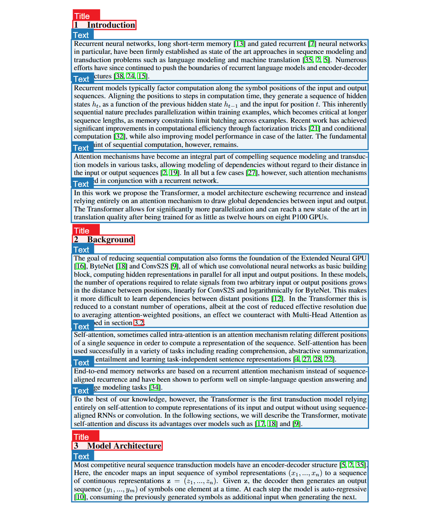
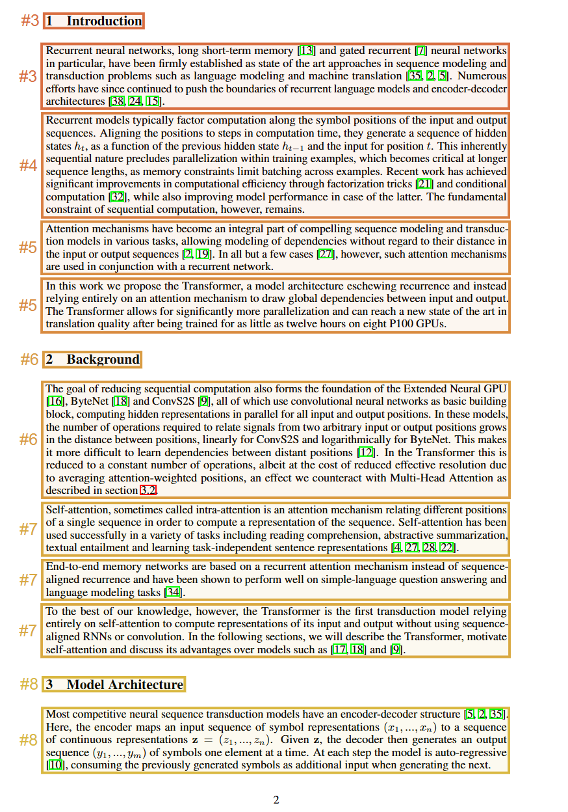

这是我个人所做的第二个开源项目。在这个项目中，我充分实践了之前学到的架构设计、技术选型、开发技巧以及运维部署。这个项目全面拥抱 AI 编程，探索如何更好地使用 AI 来辅助编程，如何更加优雅地与 AI 共舞。大部分代码不是我写的，而是我提需求、测试、再提需求。

我不希望大家误读成"代码不重要了"。

其实真正重要的是：

> **AI 编程时代，需求表达能力、问题定位能力、验收能力，会变得更重要。**

如果不会提需求，AI 也帮不了你。

如果不会测试和发现问题，AI 写再快也没用。

如果不会做架构取舍，AI 只会把错误方向放大。

## 为什么做？

在复盘之前，先说说为什么要做这个项目。在使用元宝和 ima 中，我发现它们有一个很有意思的功能：当你上传 PDF 进行问答的时候，AI 可以结合 PDF 中的图片来回答。之前使用其他 AI 的时候只有纯文本的问答，这种图文并茂的对话体验明显要好很多，毕竟一图胜千言嘛。

还有就是当我对 AI 回答存疑的时候，鼠标悬停在引用上面就会有个浮窗显示参考的原文，直接点击引用后直接跳转到对应的 PDF 页面，并且高亮显示参考的段落原文。这让我感到有一丝的不可思议。

这激起了我强烈的兴趣，去逛了一圈开源社区，并没有发现类似的问答项目。正好，这给了我一个从头实践的机会。

## 怎么做？

### 1. 引用实现

说干就干，遇到的第一个问题就是这个引用是怎么实现的呢？怎么让 AI 引用召回的上下文，并且按照一定的顺序？因为我还需要定位到对应的上下文片段用于浮窗预览。

由于对这个问题的定义不太清晰，导致我在浏览器搜索很难获得想要的内容。无奈只好去问 AI 这个引用怎么设计，AI 的回复让我很震惊——完全理解我当前的问题，并且给出了引用的设计方案。我立即去验证这个想法，准备使用前后端通信的方式来模拟，后端使用准备好的假数据。

我就问 AI 有没有更加方便快捷的方式，它告诉我前端可以直接使用 mock 数据。我就在前端使用 mock 数据（特定的引用方式的 AI 回答，以及对应上下文片段），在前端进行渲染，果然是我想要的效果。

我特别感慨当前 AI 的能力，强得可怕。遇到问题多问问 AI 真的是有用。

### 2. PDF 高亮实现

那么紧接着第二个问题就是：PDF 的高亮显示到底是怎么做到的？

这个问题其实不是在这时候才开始思考的。从我第一次使用 ima 并发现 PDF 高亮这个功能时就开始思考了。我一直不得其解，更不知道在 PDF 问答中是怎么做到的。

当时公司在和省疾控中心合作做知识库相关的项目，让我去调研开源的项目。在调研到毕昇的时候，看到官方文档中说毕昇有自研的高精度 OCR 引擎，专门解析 PDF。PDF 的解析一直都是热门话题，我就把源码克隆下来研究。开源版本是不提供 OCR 识别的，OCR 是他们的产品，是要收费的。但是，我发现有一个调用这个 OCR 服务的代码文件，我看了一下这个代码，这个代码就是调用这个 OCR 引擎，并且把返回的 JSON 格式的 PDF 解析内容进行切块，以及坐标框重新分配。

我瞬间明白了 PDF 高亮是怎么实现的了：只需要把参考的 PDF 段落以及对应的坐标框记录下来，用户点击的时候跳转 PDF 文档，并且在上面对相应的区域进行高亮绘制就搞定了。没想到居然是这么设计的。然后就在这个项目中应用了这一思想。

不过，我没有照搬 bisheng 的这一递归分块方法。因为 PDF 解析的第一步版式识别，就已经识别出了 PDF 的不同元素块，这些块完美地保留了 PDF 的基本结构，完全可以利用这一先验知识进行后续的处理，而不是暴力递归切块。我使用的分块方式如下：

- 标题和下面的文本块合并
- 如果某个文本块小于规定的字数，那么就和后面的文本块合并
- 如果超过规定字数，则作为独立的 chunk

这种方式完美继承了 PDF 的段落结构。

**OCR 版式识别：**

**合并结果（前面的序号是 chunk id，id 相同表示属于同一 chunk）：**

### 3. 图表召回

如果召回 PDF 中的图表也是一个挑战。目前主流对图片的召回大致分为两种方式：

1. 使用多模态 Embedding 模型进行嵌入
2. 使用多模态模型生成图片的理解，然后进行嵌入

经过我的实验发现，大模型理解后做嵌入是要比多模态 Embedding 直接嵌入的召回率高。所以我使用的就是第二种方式处理图片。

由于表格的语义特别稀疏，也是采用大模型对表格进行理解，然后再做嵌入。大模型生成的理解只在召回时使用，最终召回的上下文还是原始表格。这种方式对表格的召回有明显的提升。

### 4. AI 编程

这次项目过程中使用了不同的编程工具，最终使用的是 Kiro。Kiro 的 spec 驱动开发实际体验下来效果明显要好不少。

在编程过程中，我针对同一功能分别尝试了 vibe coding 和 spec coding：

- **vibe coding**：经常发生偏差，我给的指令是比较清晰的，但是模型执行着就会发生一些问题
- **spec coding**：先写好需求文档，我会严格审核这个需求文档是否清楚描述了我的需求。需求文档没有问题，设计文档和执行任务一般也就没啥问题

Kiro 最爽的就是手动点击每个任务，然后系统会把这些任务全部加入到执行队列中。每个任务都是新的会话，不会因为上下文过长导致模型能力骤降。并且在关键阶段设置检查和测试，确保功能都完美实现了。

说实话，我基本没有去 review AI 写的代码。我告诉 AI 务必严格进行测试，告诉 AI 明确的测试方向，把重心放在测试、架构设计和验收上面，剩下的交给 AI 自由发挥。使用的模型是 Claude，Claude 在写代码上面是真的让人省心。

### 5. 遇到 AI 搞不定的问题怎么办？

这里的"搞不定"指的是告诉 AI 解决同一个问题，尝试了两三次都搞不定的意思。可能花费更多时间，AI 也能搞定。那么如何让 AI 更加快速准确地搞定遇到的 bug 呢？

**最好的方式就是给 AI 足够的背景信息。** 这个背景信息哪里来呢？答：日志。让 AI 帮你在报错的位置加上详细的日志输出，依旧不需要你动手。让 AI 加上日志后，重新运行，AI 根据日志大概率可以帮你快速搞定。这是个很实用的技巧。

如果加上日志都搞不定呢？我还真遇到过。不是后端逻辑，是前端的组件库 bug——组件的点击 bug，鼠标无法点击。由于我对前端开发的理解不深，我只能让 AI 帮我解决。这个 bug 搞了 2 个多小时都没搞定，打日志、让 AI 分析全都没有用。鼠标事件是可以监听的，但是就是没办法点击。我甚至都不知道当前的问题到底出在哪，搜也不知道怎么搜。

眼看着 AI 搞不定，我就让 AI 描述当前的问题，给出 Google 的搜索关键词，我自己去搜。果然在 GitHub 的 issue 里面发现大家遇到了同样的问题。我直接把 issue 中的描述贴给 AI，AI 直接搞定了。

强调一下，帮我分析解决的是 Gemini。每次遇到其他 AI 搞半天都搞不定的前端 Bug，我都去找 Gemini。Gemini 每次都可以理解我的问题，告诉我怎么解决。Gemini 成了我的最后底牌，哈哈哈。

### 6. 架构设计

为什么在 AI 编程中架构尤为重要呢？

这个项目并不是我首次使用 AI 编程做的项目。在其他项目中，我没有做架构设计，看着 AI 越写越乱，我根本不知道核心逻辑在哪，每次遇到问题都找半天。软件开发的复杂度直接拉满，毫无软件工程可言。

所以我痛定思痛，这次尤为注重架构的设计。这个在开发之前就需要和 AI 讨论制定下来的，目的就是让功能模块清晰，降低模块之间的耦合，也便于后续做功能扩展和维护。

**所以架构的设计是一定不能省的。**

### 7. 如何做出好看的前端页面？

人类作为视觉动物，好看的前端页面一定是讨喜的。我的建议是：

> 选择一个你最喜欢的网站，然后丢给 AI 去复刻，然后根据你的个性去进行微调和修改。

不要直接让 AI 给你生成页面，不然你会知道 AI 的审美有多糟糕。

我是一个对前端开发基本不怎么了解的人，但是在 AI 时代完全不必担心。AI 非常擅长写前端，最大的限制反倒是我们自己的审美和想象力。

### 8. 如何最大化开发效率？

让 AI 充分理解你要开发的系统：

- 有哪些核心功能
- 基本交互是什么

写出一份文档，然后前后端分离，两端同时开干。前端使用 mock 数据，这就需要我们提前大致思考清楚前端的交互，以及后端会返回什么数据到前端。不必过分清晰定义，有 AI 后续对接的时候调整也很方便。

**这样你的开发效率至少提升 1.5 倍，赛博监工有没有搞头？**

当然还有其他很多的思考和设计，比如：

- 问答中引用的图片怎么渲染
- PDF 高亮显示如何快速地渲染，而不是让用户等半天才渲染出来
- 会话和知识库问答怎么区别
- 文件怎么存储
- 支持多种模型：文本生成、多模态、思考模型
- 支持从任意节点编辑和重新生成

这些都需要我们更多的思考，篇幅有限，没有办法全部说明。

## 我的思考

既然 AI 这么强大，作为开发者如何更好地使用它反倒是我们需要快速掌握和学习的地方。没有什么排斥的，我也不认为 AI 会在短期内取代程序员。但凡使用 AI 开发过完整项目的都会清楚地感受到 AI 的短板。

不必对未来过于悲观，也不盲目乐观。脚踏实地的探索才是正道。

回到开头所说：**AI 编程时代，需求表达能力、问题定位能力、验收能力，会变得更重要，思考变得更重要。**

并不是说代码不重要了，重要的是需要解决什么实际问题，你怎么从软件工程的视角理解这个问题。代码只是实现的工具而已。如果一个东西告诉你，你现在不需要写代码了，我可以帮你写，甚至比大多数人都要写得好、写得快。我认为这是好事——它帮你把手动搬砖的工作抢去了，而你要做的就是告诉它怎么帮你把房子盖好。

只要能把房子盖好，并且保证质量，那么这个砖是谁来搬，我认为都不重要了。

甚至因为盖一个房子的速度变快、成本变低，反而拥有了更大的市场。长期来看，说不定需要更多从事该行业的人。

不管怎样，以发展的眼光看问题，脚踏实地的实践，建立学习、实践、复盘的习惯，不断提升个人能力才是最重要的事情。
