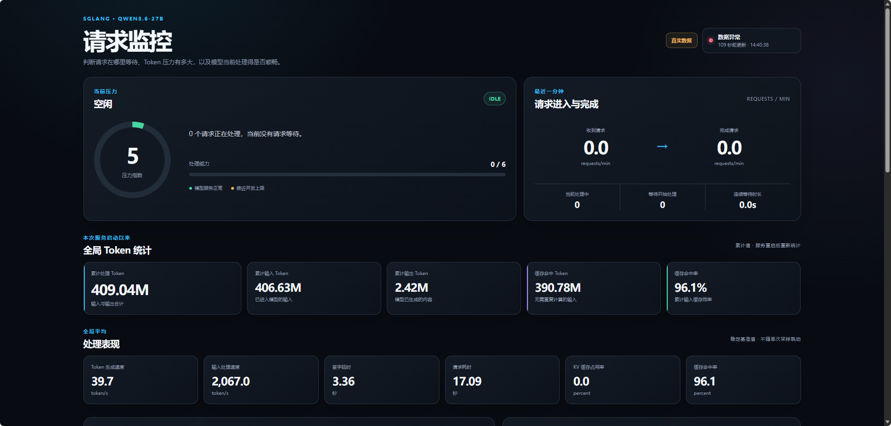

# 从测试反馈“模型有点卡”到可持续优化：一次 SGLang 长上下文推理实战

在大模型服务中，模型有点卡是最常见、也最难处理的反馈之一。

它可能是请求排队、首 Token 延迟，也可能是已经开始输出但生成速度下降；可能来自 GPU、网络或网关，也可能只是多个长上下文请求同时进入后，调度器出现了计算积压。

本文记录一次 Qwen3.6-27B 在 SGLang 上的真实排查与优化。重点不在某个参数的“标准答案”，而在于如何从模糊反馈建立证据链，识别 Prefill 和 Decode 的不同瓶颈，再通过参数、日志和可视化形成持续优化闭环。

## 1. 运行环境与问题现象

模型服务运行在 4 张 NVIDIA L20 46 GB GPU 上，使用 SGLang 0.5.12、TP4 和 262K 上下文，由 Supervisor 管理。

业务是持续运行的自动化任务。随着会话推进，工具输出和历史消息不断累积。使用人员反馈模型推理“有点卡”，但当时无法确定：

- 请求是否在服务端排队；
- 时间消耗在输入计算还是输出生成；
- GPU 是否繁忙或显存不足；
- Cache 命中是否有效；
- 卡顿是单个异常请求，还是持续高并发导致。

第一原则是：不要先调参数，先确认真实运行状态。

## 2. 从运行进程还原真实配置

部署文档和配置文件只能说明“计划如何启动”，真正生效的参数必须从运行进程、Supervisor 配置和 SGLang 启动日志交叉确认。

```bash
ps -eo pid,ppid,lstart,etime,args | grep -Ei 'sglang|launch_server'
supervisorctl status
grep -Rni 'sglang' /etc/supervisord.conf /etc/supervisord.d
```

原服务的关键生效参数为：

```text
tp_size=4
context_length=262144
mem_fraction_static=0.8
kv_cache_dtype=fp8_e4m3
chunked_prefill_size=4096
max_prefill_tokens=16384
max_running_requests=44
schedule_policy=fcfs
num_continuous_decode_steps=2
enable_metrics=False
```

这里还发现了一个容易忽略的问题：启动命令虽然配置了 Mixed Chunk，但 NEXTN/EAGLE 推测解码会将其自动关闭。推理优化不能只看命令行写了什么，必须查看启动日志中的最终 `server_args`。

## 3. 先排除故障，再分析性能

排查性能问题前，先检查更直接的故障：

```bash
supervisorctl status
nvidia-smi
dmesg -T | grep -Ei 'NVRM|Xid|oom-killer|Out of memory'
grep -Ein 'error|exception|oom|cuda|nccl|timeout|failed' /var/log/sglang-*.log
```

结果显示：

- 服务持续运行，没有反复崩溃；
- 没有 CUDA OOM、GPU Xid 或 ECC 错误；
- GPU PCIe 链路正常；
- 每卡约 41 GB 显存主要来自模型、CUDA Graph 和静态 KV Cache；
- 历史最高 Token 使用率约 43%，KV Cache 远未耗尽。

因此，“显存看起来很满”不是本次卡顿原因。SGLang 会预分配显存，判断容量压力应看实际 Token 使用率、请求回收和 OOM，而不能只看 `memory.used`。

## 4. 把卡顿拆成 Prefill 和 Decode

SGLang 调度日志提供了定位问题的关键证据。

Prefill 日志主要关注：

```text
cached-token   已命中缓存、不需要重复计算的输入
new-token      当前批次实际执行 Prefill 的输入
pending-token  尚未完成 Prefill 的输入积压
queue-req      等待获得调度机会的请求
```

Decode 日志主要关注：

```text
running-req    当前同时生成的请求
full-token     当前活跃 Token 工作集
gen throughput 整个 batch 的聚合生成吞吐
```

需要特别注意：`pending-token` 是多个请求的输入积压，不是单个 Prompt 长度；`gen throughput` 是 batch 总吞吐，也不是单请求速度。

## 5. 证据指向长上下文并发

为了避免把 batch 合计误认为单请求上下文，只统计 `new-seq=1` 的记录。结果显示，单请求缓存上下文在数小时内从约 60K 增长到 172K。整体聚合估算如下：

```text
平均有效上下文：约 94.5K Token/请求
聚合缓存命中率：约 96.5%
Prefill pending 峰值：621,390 Token
排队请求峰值：9
最长连续排队：约 89 秒
```

高 Cache 命中率说明 Radix Cache 确实有效，但它不能消除长上下文的全部成本：

- 未命中的新增内容仍需 Prefill；
- 多个长请求同时到达时，新增 Token 会形成巨大 backlog；
- 每生成一个新 Token，Decode 仍需访问长上下文对应的 KV 状态；
- 多个长请求并发 Decode 会竞争同一组 GPU 资源。

历史数据也验证了并发对单请求体验的影响：

| 同时运行请求 | batch 聚合吞吐中位数 | 估算单请求吞吐 |
| ---: | ---: | ---: |
| 1 | 77.94 token/s | 77.94 token/s |
| 4 | 221.19 token/s | 55.30 token/s |
| 8 | 169.45 token/s | 21.18 token/s |
| 9 | 180.06 token/s | 20.01 token/s |

并发增加不等于单请求更快。系统可能仍保持较高总吞吐，但每个用户获得的生成速度已经明显下降。

### 7 月 28 日 11:50–11:56 持续性高压

这一阶段不是单次尖峰，而是持续数分钟的长上下文高并发：

```text
Prefill batch：164 次
新增 Prefill Token：约 389K
pending-token 峰值：292,965
queue-req 峰值：3
running-req 峰值：8–9
full-token 峰值：约 486K
```

典型日志：

```text
11:51:12 queue=3, pending=208013
11:51:14 queue=3, pending=292965
11:51:15 new-seq=4, cached=288128
11:52:40 new-seq=2, cached=250077
11:54:35 new-seq=2, cached=266490
11:55:52 new-seq=3, cached=346938
```

这说明第持续提交多条 100K 左右的长上下文请求。此时用户体验不是偶尔停顿，而是长时间处于较高 TTFT 和较低单请求 Decode 速度。

最终问题可以还原为：

```text
长会话持续增长
    ↓
多条长上下文请求集中到达
    ↓
Chunked Prefill backlog 快速增加
    ↓
后到请求的首 Token 延迟升高
    ↓
8～9 个长请求同时 Decode
    ↓
单请求生成速度下降
```

这不是单一参数错误或硬件故障，而是吞吐优先的默认并发策略与真实在线长上下文负载不匹配。

## 6. 优化参数：控制竞争，而不是盲目追求高并发

优化后的核心参数如下：

```bash
--tp-size 4
--context-length 262144
--mem-fraction-static 0.78
--kv-cache-dtype fp8_e4m3

--chunked-prefill-size 8192
--max-prefill-tokens 16384
--max-running-requests 10
--cuda-graph-max-bs 24
--schedule-policy lpm

--num-continuous-decode-steps 1
--enable-cache-report
--enable-metrics
```

NEXTN 推测解码、动态批量 Tokenizer 和 fused QK Norm/RoPE 等能力继续保留。

主要调整及设计意图如下：

| 调整 | 设计意图 |
| --- | --- |
| 运行并发从自动放大限制为 10 | 避免大量长请求进入计算阶段，导致压力暴增，提升系统推理稳定性 |
| Prefill 分块从 4096 调整为 8192 | 减少超长输入所需的调度轮数，更快消化积压 |
| Prefill 总量继续限制为 16384 | 防止单次输入计算长时间占用 GPU |
| 连续 Decode 步数从 2 调整为 1 | 让调度器更频繁地在新请求和已有请求之间决策 |
| FCFS 改为 LPM | 优先利用更长的公共前缀，快速处理这些请求 |
| 静态显存比例调整为 0.78 | 当前KV Cache空间完全够用，为运行时张量、通信和波动保留安全余量 |
| 显式限制 CUDA Graph batch | 控制图捕获范围与额外显存成本 |
| 开启 Metrics | 让优化效果可以被持续观察和验证 |

这些参数是一组协同取舍，而不是孤立的“最佳值”。

例如，增大 Prefill 分块可以更快处理长输入，但也可能增加单轮 Prefill 对 Decode 的干扰；因此同时降低运行并发和连续 Decode 步数，让调度器在输入处理效率和在线响应之间重新取得平衡。

限制并发也不代表拒绝请求。请求仍可在队列中等待，只是不再让过多长上下文同时进入执行阶段。对于在线服务，受控排队通常优于所有请求一起运行、最终全部变慢。

需要诚实说明：参数已经按上述设计部署，但最终收益仍应通过相同业务流量或分层压测验证，不能仅凭服务成功启动就宣称优化完成。

## 7. 为什么还需要独立日志

用户反馈通常发生在问题之后。当前的 `nvidia-smi` 只能说明“现在是否繁忙”，无法回答十分钟前请求为什么卡顿。

为此增加了独立采集器，每 5 秒读取：

1. SGLang `/metrics`；
2. `nvidia-smi` 的 GPU 利用率和显存数据。

监控数据按统一时间戳写入 CSV，同时生成实时 JSON 和分钟级历史数据。核心内容包括：

- 当前处理、等待开始处理的请求数；
- 最近一分钟收到和完成的请求数；
- 连续排队时间；
- 输入处理和 Token 生成速度；
- 首字延时、请求耗时和队列耗时；
- 累计输入、输出、缓存命中和总 Token；
- KV 已占用量、容量上限和等待计算的输入 Token；
- 正在处理输入、等待 KV 资源等 Prefill 状态；
- 每张 GPU 的利用率与显存占用。

原始 SGLang 日志继续保留，用于查看最终参数、调度细节和异常堆栈；结构化 CSV 用于快速定位异常时间段；JSON 用于获取当前完整状态。

这种设计也方便 AI 分析：稳定字段、统一时间戳和 CSV/JSON 格式比大量自由文本更适合过滤、聚合和关联。正确的排查方式是先用结构化指标缩小时间窗口，再回到原始日志解释具体行为。

为避免监控撑满磁盘，数据最多保留 7 天并设置总容量上限，历史文件按日期轮转压缩。日志不记录完整 Prompt、模型回复或 API Key。

## 8. 面向人的实时监控页面


日志适合复盘，但不适合人在收到反馈后快速判断。于是增加了一个轻量页面：

```text
SGLang /metrics ─┐
                 ├─ 采集器 ─ latest.json + 历史 CSV ─ 静态 Web 页面
nvidia-smi ──────┘
```

页面不进入模型请求链路，也不依赖复杂数据库。即使监控页面异常，也不会影响推理 API。

页面重点展示四类信息：

**当前压力**

- 当前处理中、等待开始处理；
- 最近一分钟收到与完成；
- 连续等待时长；
- 综合压力状态。

**全局基准**

- 累计输入、输出、缓存命中和总处理 Token；
- 全局平均输入处理速度和生成速度；
- 全局平均首字延时与请求耗时；
- 累计缓存命中率。

全局平均用于建立稳定基线，避免单次采样造成数字持续跳动。

**请求所处阶段**

- 等待开始处理；
- 等待计算资源；
- 正在处理输入；
- 当前处理中。

页面使用业务语义，而不是直接展示 `queue`、`prefill prealloc` 等内部名称，帮助使用者判断请求卡在调度、资源分配还是输入计算。

**Token、趋势和 GPU**

- KV 已占用 Token、容量上限和占用率；
- 等待计算的输入 Token；
- 请求进入、完成、排队和延时趋势；
- GPU 利用率与显存概况。

这些数据放在同一时间轴后，可以快速区分几种常见情况：

- GPU 利用率高且 Pending Token 增长：输入计算积压；
- Queue 增长但 KV 占用不高：计算或调度瓶颈，不是容量耗尽；
- Running 接近上限且生成速度下降：Decode 并发竞争；
- 显存占用高但 GPU 空闲：静态预分配，不代表服务繁忙。

## 9. 最终形成持续优化闭环

一次参数调整不是优化工作的终点。更可靠的流程是：

```text
用户反馈
   ↓
页面确认异常阶段和时间
   ↓
CSV 量化请求、Token、延时与 GPU 趋势
   ↓
原始日志解释调度行为
   ↓
提出参数或业务侧优化假设
   ↓
使用相同负载验证
```

当前方案解决的是服务级观测和瓶颈分类，还不是完整的逐请求追踪。若要进一步分析尾延时，后续可以贯通请求 ID，并记录逐请求 TTFT、TPOT、E2E、输入长度和输出长度。

但最重要的变化已经发生：当用户再次反馈“模型有点卡”时，不再需要根据显存占用或主观体验猜测。系统能够留下证据，AI 可以读取结构化数据，人可以直观看到压力，参数调整也能够被持续验证。

这比寻找某个孤立的“神奇参数”，更接近真实生产环境中的大模型推理优化。
